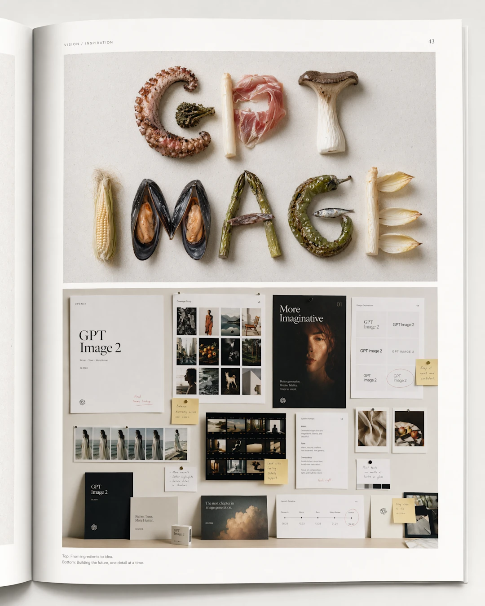
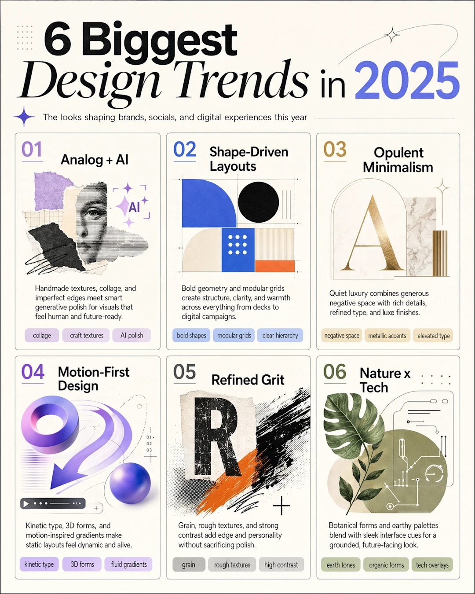
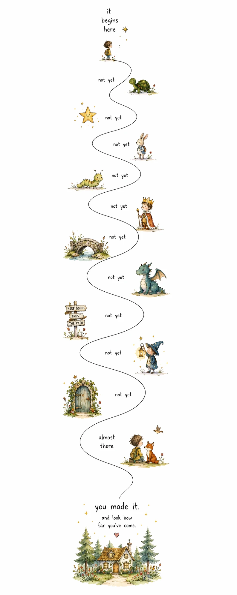
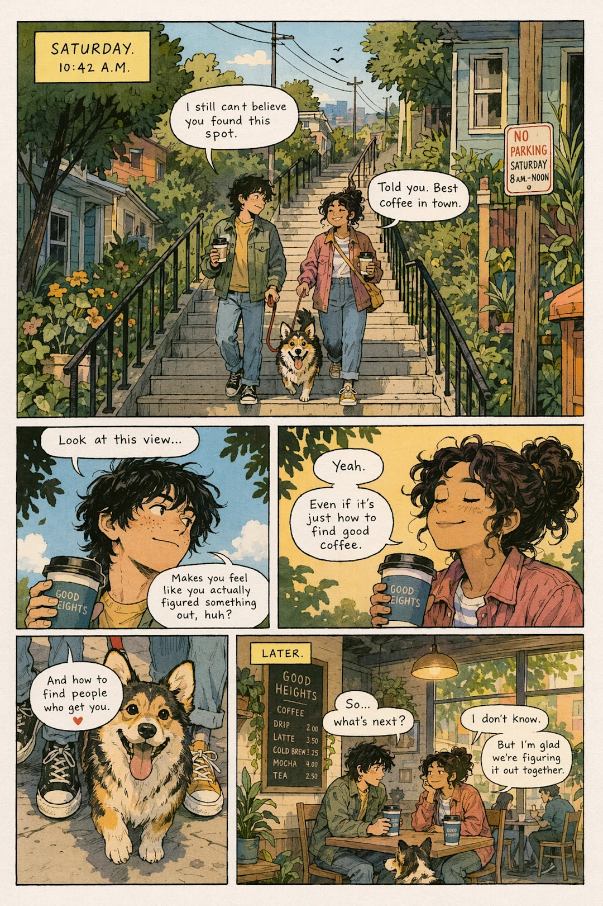
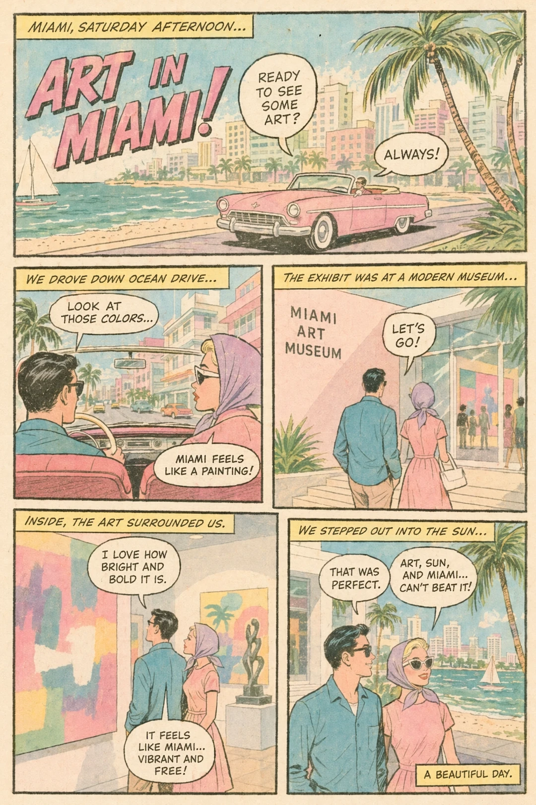
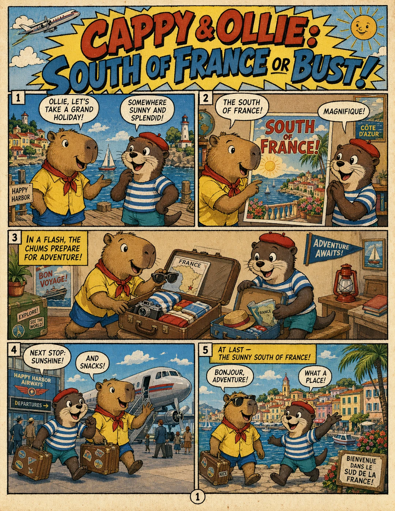
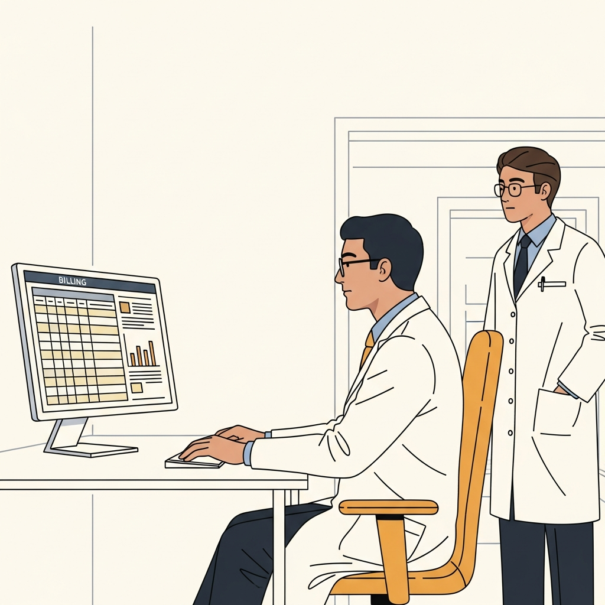
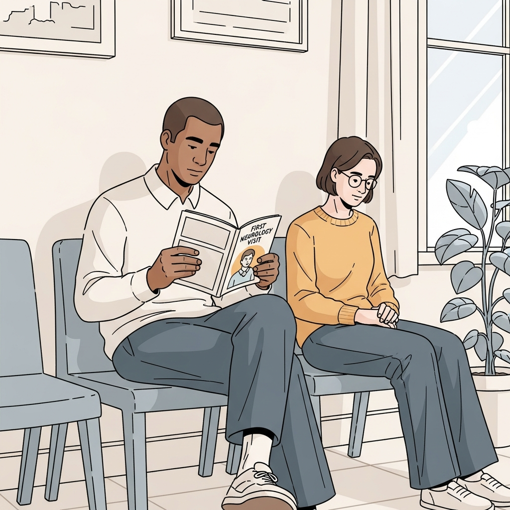
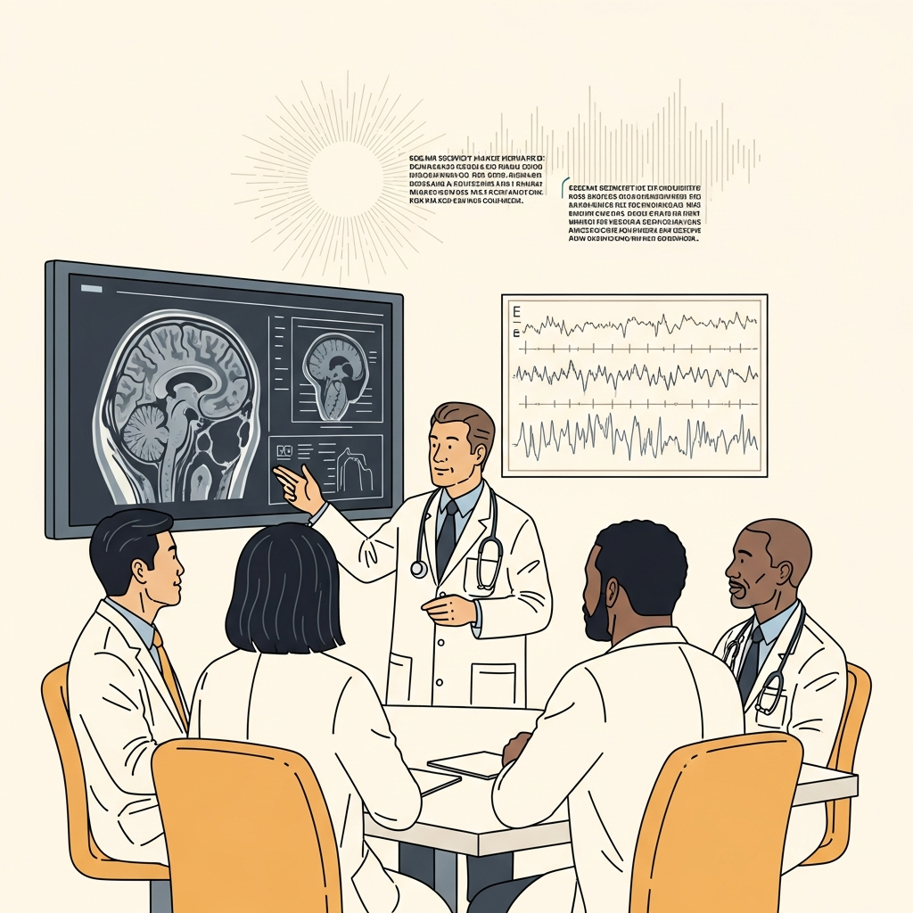
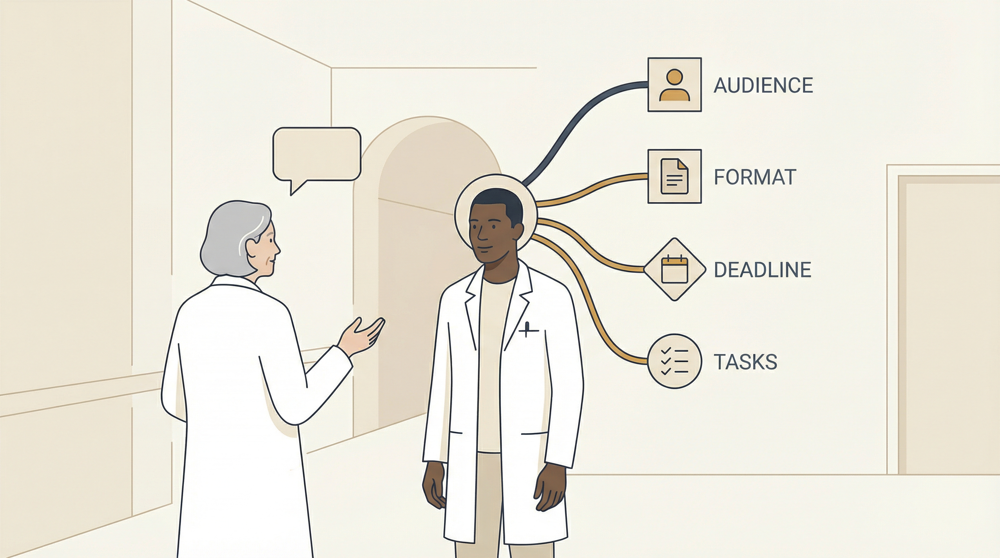

# Illustration Production Style Lane Gallery

Use this page as the quick "what does this style represent?" view before choosing a lane. For full production rules, read `references/illustration-guide.md`.

Image paths are relative to this `references/` folder so they render in GitHub.

## Warm Editorial Analog Clarity

Represents: thoughtful editorial explanation, essays, conceptual covers, knowledge visuals, reflective education.

Visual feel: warm paper, tactile analog texture, restrained palette, generous negative space, one clear idea, designed but not glossy.

Use when the image should feel humane, intelligent, quiet, and publication-ready.

Primary reference: `references/openai-image-2-reference-style-guide.md`

Example asset family: `assets/style-guide/`

Visual examples:

<table>
  <tr>
    <td></td>
    <td></td>
    <td></td>
  </tr>
  <tr>
    <td>Art-directed moodboard: tactile, restrained, premium editorial layout.</td>
    <td>Shape-driven design board: modular hierarchy, geometry, clean scan path.</td>
    <td>Sparse storybook path: large white space, tiny vignettes, gentle pacing.</td>
  </tr>
</table>

Avoid: glossy AI finish, stock-photo realism, clutter, cinematic lighting, cold corporate vector sameness.

## Patient Education Indie Comic

Represents: patient journeys, clinic education, waiting-room explainers, human-centered medical storytelling.

Visual feel: warm slice-of-life comic, calm clinic settings, intimate body language, readable scene cards, text handled outside the generated image when accuracy matters.

Use when the asset needs empathy, sequence, character continuity, and patient-facing clarity.

Canonical source: project-local Waiting Room Comics style files when present.

Visual examples:

<table>
  <tr>
    <td></td>
    <td></td>
    <td></td>
  </tr>
  <tr>
    <td>Indie comic warmth: intimate scenes, soft environment detail, human tone.</td>
    <td>Retro pastel comic: bright journey energy, sun-faded print texture.</td>
    <td>Adventure comic: bold mascot readability and strong panel energy.</td>
  </tr>
</table>

Avoid: giant speech balloons, dense panel grids, melodrama, hero-doctor/passive-patient staging, generated clinical text.

## Minimal Academic Cover

Represents: specialist podcast covers, episode art, academic publication markers, abstract research themes.

Visual feel: one restrained abstract motif on warm paper, minimal text, strong thumbnail readability, no literal medical collage.

Use when the image should signal scholarship and topic identity without becoming an infographic.

Canonical source: AED cover design docs when present.

Visual examples:

No dedicated accepted cover image is bundled in this skill yet. Use the visual discipline from Warm Editorial Analog Clarity, but reduce the image to one abstract motif, minimal text, and strong thumbnail readability.

Avoid: skulls, hospital rooms, microphones, lightning, fake EEG clutter, copied reference compositions, overexplained medical symbolism.

## Swiss Editorial Clinical Flat

Represents: clinical-academic slide visuals, workshop illustrations, simple medical process scenes, professional teaching graphics.

Visual feel: warm off-white background, muted ink outlines, flat figures, cream/slate/blue-gray/ochre palette, calm academic clinical space.

Use when the image belongs in a lecture, talk, workshop, or professional medical presentation.

Exemplar assets:

- `assets/ai-beyond-chatbot/slide6-panel1.png`
- `assets/ai-beyond-chatbot/slide6-panel2.png`
- `assets/ai-beyond-chatbot/slide6-panel3.png`
- `assets/ai-beyond-chatbot/slide3-illustration.png`
- `assets/ai-beyond-chatbot/slide4-illustration.png`

Visual examples:

<table>
  <tr>
    <td></td>
    <td></td>
    <td></td>
  </tr>
  <tr>
    <td>Flat clinical scene: calm, legible, uncluttered.</td>
    <td>Process-oriented medical visual: muted outlines and simple staging.</td>
    <td>Professional teaching tone: clinical but not cold.</td>
  </tr>
  <tr>
    <td></td>
    <td></td>
    <td></td>
  </tr>
  <tr>
    <td>Workshop visual: one claim, readable from slide distance.</td>
    <td>Clinical-academic illustration: restrained palette and clear hierarchy.</td>
    <td></td>
  </tr>
</table>

Avoid: glossy UI, realistic office rendering, saturated orange dominance, fake paragraphs, busy props, cinematic drama.

## Semantic Typography Concept Poster

Represents: a word, phrase, or short sentence becoming the image structure itself.

Visual feel: giant readable title, one strong metaphor, type as architecture or atmosphere, high-impact poster design, strong negative space, restrained color.

Use when the core idea is textual and should become a visual symbol rather than sit beside an illustration.

Prompt references:

- `references/semantic-typography-concept-poster-verbatim-prompt.md`
- `references/semantic-typography-geometric-poster-template.md`
- `references/semantic-typography-geometric-poster-shenjingneike.md`

Visual examples:

No rendered semantic typography image is bundled yet. The current examples are prompt/spec examples only:

- `references/semantic-typography-concept-poster-verbatim-prompt.md`
- `references/semantic-typography-geometric-poster-template.md`
- `references/semantic-typography-geometric-poster-shenjingneike.md`

Avoid: misspelled or unreadable title, separated text/image layers, random fake English, multi-column information boards, decorative symbols unrelated to meaning.

### Geometric Typographic Concept Poster Option

Represents: a cleaner, more modern, flat-geometric version of semantic typography.

Visual feel: crisp vector-like precision, modular grids, color fields, thin connecting lines, transparent layers, symbolic nodes, restrained data-like details.

Use when the word should feel like a designed system, identity mark, concept poster, lecture cover, or exhibition graphic.

Example: `神经内科` as a clinical-neural type system with nodes, diagnostic frames, signal lines, and clean medical palette.
